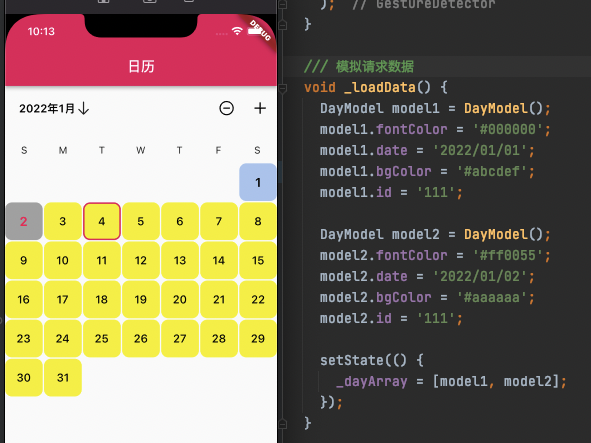

# 关键 api (key api)

## 1. 某年某月的第一天是星期几 (weekday of the first day of this month)

```dart
final firstDay = DateTime(year, month).weekday;
```

## 2. 某年某月有多少天 (number of days of this month)

```dart
final days = DateUtils.getDaysInMonth(year, month);
```

